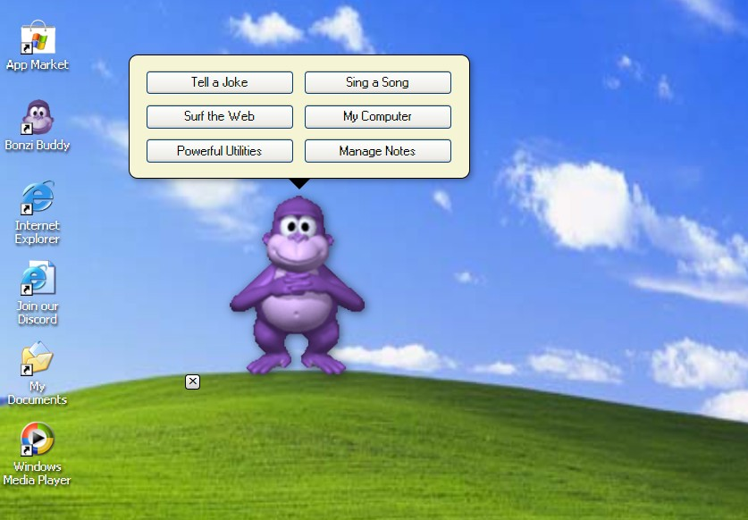

# BonziBUDDY for Reborn XP

A faithful, interactive recreation of the iconic 2000s desktop assistant, BonziBUDDY, reimagined as a safe and fully functional application for the **Reborn XP** operating system simulator.

This project is a tribute to the era of skeuomorphic design and interactive desktop companions. It captures the original's personality—from his songs and jokes to his mischievous behavior—in a secure, modern, and spyware-free reimplementation. This is just a simulation for entertainment and educational purposes.

---

This is not a standalone application for modern operating systems like Windows. It is designed to run exclusively within **Reborn XP**, a comprehensive, web-based Windows XP simulator.

To use BonziBUDDY, you must first launch the Reborn XP in your browser.

**Reborn XP Features:**
- A complete, persistent virtual desktop environment.
- Authentic themes, sounds, and applications.
- A virtual file system to store your work.
- An integrated **App Market** for installing new applications like this one.

### [➡️ Launch Reborn XP to Get Started](https://xp.quenq.com/)

---

## Key Features

This BonziBUDDY simulation has been rebuilt from the ground up to be feature-complete and authentic to the original experience.

*   **Authentic Voice & Songs:** Features the original, full-length songs sung by Bonzi, complete with perfectly synchronized on-screen lyrics. All audio has been carefully sourced for the highest possible quality.

*   **Interactive Personality:** Engage with Bonzi as he tells jokes from his classic repertoire, offers to surf the web, or tempts you with "powerful utilities" from the E: drive.

*   **Advanced Evasion Mechanics:** Bonzi doesn't like being closed. After initial protests, he will actively flee your cursor and teleport his close button to evade clicks, offering a fun challenge to the user. Clicking on him directly will cancel the evasion.

*   **Full OS Integration:** Bonzi interacts with the Reborn XP environment. He can open Internet Explorer, My Computer, and specific folders. He also saves a "secret" user file to your virtual `D:\` drive.

*   **Notes Manager:** Includes a fully functional notes utility where users can create, view, edit, and delete personal notes, which are then saved to their user file.

*   **Safe & Spyware-Free:** This simulation is completely safe. It contains no spyware, trackers, or malware. All data is stored locally in your browser's storage for the `xp.quenq.com` website and is never transmitted.

## Installation Instructions

BonziBUDDY must be installed via the App Market inside Reborn XP.

1.  **Launch Reborn XP:** Navigate to **[xp.quenq.com](https://xp.quenq.com/)** in your web browser.
2.  **Open the App Market:** Once the desktop has loaded, click the **Start Menu**, navigate to **All Programs**, and launch the **Quenq App Market**.
3.  **Find and Install:** Use the search bar to find **BonziBUDDY** and click the "Install" button.
4.  **Run BonziBUDDY:** The installer will create a shortcut on your virtual Desktop and an entry in your Start Menu. Double-click either to launch him!

---

## Technical Details

This application is open-source and built in compliance with the official [Reborn XP SDK](https://github.com/Quenq-Systems/reborn-xp-sdk), ensuring seamless integration and performance.

The project is structured into three primary modules for maintainability:
- **`bonzi.js`**: The main application loader and entry point.
- **`bonzi-logic.js`**: A self-contained class that manages all state, user interaction, animations, and behavioral logic.
- **`bonzi.css`**: The stylesheet defining the appearance of the BonziBUDDY character and his speech bubble UI.

Contributions are welcome. If you have a feature suggestion or a bug fix, please feel free to fork this repository and submit a pull request.

---

## ⚠️ Important Disclaimer: Simulation, Not Spyware

This project is a **simulation** and a work of parody created for entertainment and educational purposes. **It is NOT real spyware or malware.**

The "personal information" BonziBUDDY asks for (name, age, etc.) is only used within the simulation for entertainment and educational purposes—you can even enter fake data. All data, including the notes you save, is stored locally in your browser's private storage for the `xp.quenq.com` website and is **never transmitted** off your computer. The `top_secret_user.txt` file is created on your *virtual* D: drive inside the simulator, not on your real computer's hard drive.

## License

This project is provided under the [MIT License](LICENSE).
